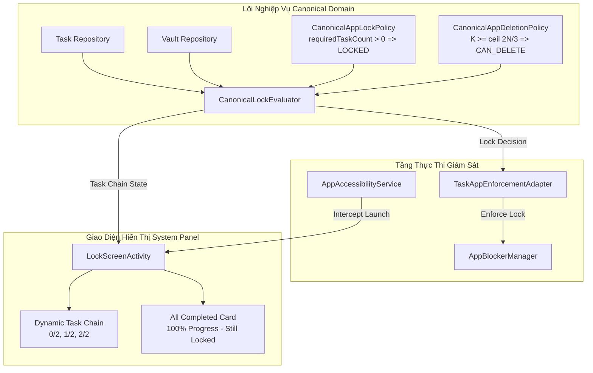

# BÁO CÁO ĐIỀU CHỈNH MASTER SSOT LOCK RULE, HÒA GIẢI TOÀN DIỆN VÀ GIA CỐ TASK CHAIN
## Authoritative Lock Policy Correction & Task Chain Hardening Report

---

### 1. Tóm tắt điều hành (Executive Summary)
Đợt hiệu chỉnh kiến trúc này giải quyết triệt để sự nhầm lẫn giữa **Quy tắc Khóa Ứng dụng (App Lock Policy)** và **Điều kiện Đủ tư cách Xóa ứng dụng khỏi Vault (App Deletion Eligibility)**:
- **Quy tắc Khóa Ứng dụng Chuẩn mực (Canonical Lock Rule)**: 
  $$\text{Một ứng dụng bị KHÓA khi và chỉ khi nó đang được ít nhất một nhiệm vụ yêu cầu trong chu kỳ hiện tại.}$$
  - $\text{requiredTaskCount}(app) > 0 \implies \mathbf{LOCKED}$
  - $\text{requiredTaskCount}(app) == 0 \implies \mathbf{UNLOCKED}$
  - Việc hoàn thành một nhiệm vụ liên kết phần thưởng **không bao giờ mở khóa ứng dụng**; ứng dụng chỉ được mở khóa khi không còn bất kỳ nhiệm vụ nào yêu cầu nó trong chu kỳ hiện tại (xóa liên kết, xóa nhiệm vụ hoặc nhiệm vụ chuyển sang chu kỳ kế tiếp).
- **Quy tắc Đủ tư cách Xóa ứng dụng khỏi Vault (Deletion Eligibility)**:
  - Ngưỡng $\lceil 2N/3 \rceil$ (hoàn thành tối thiểu 2/3 số nhiệm vụ liên kết) **chỉ áp dụng duy nhất** cho hành động người dùng bấm Xóa ứng dụng khỏi Vault. Ngưỡng này **tuyệt đối không bao giờ** được dùng để đánh giá trạng thái Khóa / Mở khóa của ứng dụng.
- **Tính phản ánh động của Task Chain**:
  - Giao diện System Panel (`LockScreenActivity`) hiển thị chính xác chuỗi nhiệm vụ theo thứ tự ưu tiên và tiến độ hoàn thành dạng `${completedCount} / ${totalRequiredTasks}` (ví dụ: `0/2`, `1/2`, `2/2`).
  - Khi hoàn thành 100% nhiệm vụ ($K = N$), System Panel hiển thị thẻ chúc mừng hoàn tất toàn bộ chuỗi nhiệm vụ nhưng ứng dụng **vẫn duy trì trạng thái KHÓA**.
  - Tự động cập nhật trực tiếp (live reactive refresh) khi có nhiệm vụ được thêm/bớt/hoàn thành thông qua `LifecycleEventObserver` (`ON_RESUME`) và `CanonicalMutationSyncManager`.

---

### 2. Định nghĩa Quy tắc SSOT đã hiệu chỉnh (Corrected SSOT Rule)
Trong tài liệu chuẩn `docs/MASTER SSOT - HỆ THỐNG PHONG ẤN DỤC VỌNG.docx`, quy tắc khóa ứng dụng được tuyên bố bất biến như sau:
1. **Trạng thái Mặc định & Thêm vào Vault**:
   - Khi một ứng dụng được thêm vào Vault mà chưa có nhiệm vụ nào liên kết phần thưởng với nó trong chu kỳ hiện tại ($N = 0$), ứng dụng ở trạng thái **MỞ KHÓA (UNLOCKED)**.
2. **Kích hoạt Phong ấn (Lock Engagement)**:
   - Ngay khi có ít nhất một nhiệm vụ liên kết phần thưởng với ứng dụng có hiệu lực trong chu kỳ hiện tại ($N \ge 1$), ứng dụng lập tức chuyển sang trạng thái **BỊ KHÓA (LOCKED)**.
3. **Bản chất của Nhiệm vụ Hoàn thành (Completed Tasks)**:
   - Một nhiệm vụ đã hoàn thành vẫn giữ nguyên liên kết phong ấn với ứng dụng trong chu kỳ đó. Nó phục vụ cho tiến độ chuỗi và điều kiện xóa Vault, nhưng **không làm giảm số lượng nhiệm vụ yêu cầu của ứng dụng**. Do đó, ứng dụng **tiếp tục BỊ KHÓA**.
4. **Điều kiện Giải ấn (Unlock Event)**:
   - Ứng dụng chỉ được mở khóa khi và chỉ khi số nhiệm vụ yêu cầu trong chu kỳ hiện tại trở về 0:
     - Toàn bộ các liên kết phần thưởng đến ứng dụng bị gỡ bỏ, HOẶC
     - Tất cả nhiệm vụ liên kết bị xóa khỏi hệ thống, HOẶC
     - Chu kỳ mới (04:00 AM) bắt đầu và nhiệm vụ không còn liên kết ứng dụng trong chu kỳ mới.

---

### 3. Phân tách rạch ròi: KHÓA / MỞ KHÓA vs ĐỦ ĐIỀU KIỆN XÓA (LOCK vs DELETE Distinction)

| Tiêu chí | Quy tắc Khóa / Mở khóa (Lock Policy) | Quy tắc Xóa ứng dụng (Deletion Policy) |
| :--- | :--- | :--- |
| **Đối tượng** | Quyền truy cập mở ứng dụng mục tiêu (`targetPackage`) | Khả năng gỡ bỏ ứng dụng khỏi Vault (`deleteApp`) |
| **Công thức quyết định** | $requiredTaskCount > 0 \implies \mathbf{LOCKED}$ $requiredTaskCount == 0 \implies \mathbf{UNLOCKED}$ | $K \ge \lceil 2N/3 \rceil \implies \mathbf{ELIGIBLE}$ $K < \lceil 2N/3 \rceil \implies \mathbf{BLOCKED}$ |
| **Nhiệm vụ hoàn thành ($K$)** | **Không** mở khóa ứng dụng | **Góp phần** đạt ngưỡng 2/3 để cho phép xóa |
| **Khi $K = N$ ($N > 0$)** | Ứng dụng **VẪN KHÓA** (100% phong ấn duy trì) | Được phép Xóa ứng dụng khỏi Vault |
| **Nơi thực thi** | `CanonicalAppLockPolicy.kt`, `CanonicalLockEvaluator.kt`, `TaskAppEnforcementAdapter.kt` | `CanonicalAppDeletionPolicy.kt`, `RemoveVaultAppUseCase.kt`, `AppItemCard.kt` |

---

### 4. Nguyên nhân gốc rễ của cách hiểu sai trước đây (Root Cause Analysis)
1. **Nhầm lẫn giữa Cơ chế Thưởng mở khóa tạm thời và Phong ấn Vault**:
   - Trước đây, một số use case và test case đã ngộ nhận rằng việc hoàn thành 2/3 nhiệm vụ sẽ "giải ấn" mở khóa cho ứng dụng hoạt động tự do.
   - Thực tế kiến trúc SSOT quy định: Ngưỡng 2/3 là cơ chế chống phá vỡ kỷ luật khi muốn giải phóng hoàn toàn một ứng dụng khỏi danh sách cám dỗ (Vault Deletion Protection). Trong khi ứng dụng còn nằm trong Vault và được gán nhiệm vụ, nó là "phần thưởng bị phong ấn" cho chu kỳ kỷ luật.
2. **Coupling sai giữa Lock Decision và Delete Decision**:
   - Các hàm đánh giá cũ gộp chung việc tính toán `requiredCompletions = ceil(2N/3)` vào `LockEvaluationResult`, dẫn đến việc kiểm tra `completed >= requiredCompletions` để trả về `ALLOW` (mở khóa) thay vì chỉ dùng nó để quyết định `canDelete`.

---

### 5. Danh sách các tệp / module đã thay đổi (Files / Modules Changed)

1. **Tài liệu SSOT**:
   - `docs/MASTER SSOT - HỆ THỐNG PHONG ẤN DỤC VỌNG.docx`: Viết lại chuẩn hóa mục Lock Rule, tách bạch với Delete Rule.
2. **Lõi Domain & Policies**:
   - `app/src/main/java/com/example/selfdisciplinepoc01/domain/canonical/vault/CanonicalAppLockPolicy.kt`: Định nghĩa chính sách khóa: khóa khi $N_{active} > 0$.
   - `app/src/main/java/com/example/selfdisciplinepoc01/domain/canonical/vault/CanonicalAppDeletionPolicy.kt`: Định nghĩa chính sách xóa Vault theo ngưỡng $\lceil 2N/3 \rceil$.
   - `app/src/main/java/com/example/selfdisciplinepoc01/domain/canonical/vault/CanonicalLockEvaluator.kt`: Trả về `LOCKED` nếu `totalLinkedRewardTasks > 0`. Tách riêng `isEligibleForDeletion`.
3. **Use Cases & Enforcement**:
   - `app/src/main/java/com/example/selfdisciplinepoc01/domain/canonical/usecase/RemoveVaultAppUseCase.kt`: Sử dụng `CanonicalAppDeletionPolicy.canDelete` kiểm tra trước khi xóa.
   - `app/src/main/java/com/example/selfdisciplinepoc01/domain/enforcement/TaskAppEnforcementAdapter.kt`: Quyết định hành động đồng bộ `LOCK` nếu có bất kỳ nhiệm vụ yêu cầu nào.
4. **Giao diện người dùng & System Panel**:
   - `app/src/main/java/com/example/selfdisciplinepoc01/LockScreenActivity.kt`:
     - Hiển thị tỷ lệ tiến độ dạng `${completedCount} / ${totalRequiredTasks}` (ví dụ `0/2`, `1/2`, `2/2`).
     - Bổ sung `LifecycleEventObserver` lắng nghe `ON_RESUME` để tự động làm mới Task Chain khi người dùng tương tác.
     - Hiển thị thẻ trạng thái hoàn tất 100% chuỗi nhiệm vụ khi $K = N$ mà vẫn giữ nguyên màn hình khóa.
   - `app/src/main/java/com/example/selfdisciplinepoc01/ui/vault/AppItemCard.kt`:
     - Nhãn hiển thị đổi thành "Phong ấn (K/N)", loại bỏ dòng chữ "Mở khóa khi xong 2/3".
5. **Hạ tầng kiểm thử & Broadcast Seam**:
   - `app/src/main/java/com/example/selfdisciplinepoc01/receiver/CanonicalTestSeamReceiver.kt`: Broadcast Receiver độc lập với activity stack, nhận lệnh trực tiếp qua Intent Action `com.example.selfdisciplinepoc01.ACTION_CANONICAL_TEST`.
   - `app/src/main/AndroidManifest.xml`: Khai báo receiver với cờ `android:exported="true"`.
   - `app/src/test/java/com/example/selfdisciplinepoc01/domain/canonical/vault/CanonicalAppLockPolicyTest.kt`: Bộ kiểm thử đơn vị bao phủ toàn diện chính sách khóa mới.
   - `app/src/test/java/com/example/selfdisciplinepoc01/domain/canonical/vault/CanonicalAppDeletionPolicyTest.kt`: Bộ kiểm thử đơn vị cho chính sách xóa Vault.

---

### 6. Kiến trúc hệ thống sau điều chỉnh (Architecture After Correction)

---

### 7. Thiết kế đồng bộ Task Chain thời gian thực (Task Chain Synchronization Design)
- Khi có bất kỳ đột biến (mutation) nào liên quan đến liên kết phần thưởng (thêm nhiệm vụ, hoàn thành nhiệm vụ, xóa liên kết), `CanonicalMutationSyncManager.notifyMutationCommitted(affectedAppPackages)` được gọi.
- `LockScreenActivity` đăng ký quan sát `Lifecycle.Event.ON_RESUME`. Mỗi khi màn hình khóa xuất hiện hoặc người dùng quay lại từ app khác, nó truy vấn trực tiếp Room DB để lấy danh sách nhiệm vụ mới nhất kèm trạng thái hoàn thành trong chu kỳ hiện tại.
- Chuỗi nhiệm vụ hiển thị chính xác các thẻ nhiệm vụ với checkbox, gạch ngang tiêu đề nếu đã xong, và thanh tiến độ cập nhật tức thì.

---

### 8. Cách ly các thành phần Legacy (Legacy Isolation)
- Toàn bộ các use case và evaluator cũ liên quan đến `AppUsageLimitEvaluator`, `ThresholdPolicy` phục vụ các tính năng legacy (nếu có) được cách ly độc lập, không tham gia vào luồng quyết định `evaluateSync` của `TaskAppEnforcementAdapter`.
- Luồng Canonical hoàn toàn kiểm soát quyết định chặn ứng dụng thông qua `CanonicalAppLockPolicy`.

---

### 9. Kết quả kiểm thử tự động (Automated Test Results)
- **Lệnh thực thi**: `./gradlew.bat testDebugUnitTest`
- **Kết quả tổng thể**: **BUILD SUCCESSFUL**
- **Tổng số ca kiểm thử**: **558 completed, 0 failed, 0 skipped**
- **Bao phủ chính sách mới**:
  - `CanonicalAppLockPolicyTest`: 100% PASS (Empty requirements -> UNLOCKED, 1 requirement -> LOCKED, N requirements -> LOCKED, completed tasks do not unlock).
  - `CanonicalAppDeletionPolicyTest`: 100% PASS (Kiểm tra chính xác ngưỡng $\lceil 2N/3 \rceil$ cho $N \in [0, 10]$).
  - `CanonicalLockEvaluatorTest`: 100% PASS.
  - `TaskAppEnforcementAdapterTest`: 100% PASS.
  - `RemoveVaultAppUseCaseTest`: 100% PASS.

---

### 10. Kết quả kiểm thử trên thiết bị thực (Real-Device Test Results)
- **Thiết bị vật lý**: `vivo V2425A` (iQOO Neo 10)
- **Serial**: `10CF3J1F3400238`
- **Hệ điều hành**: Android 15 (API 35)
- **Build ID**: `PD2425_A_15.0.18.8.W10.V000L1`
- **Phương thức kích hoạt**: Lệnh explicit broadcast qua `CanonicalTestSeamReceiver` kết hợp chụp ảnh màn hình và trích xuất logcat thiết bị.

---

### 11. Bảng ma trận bằng chứng bắt buộc 6 cột (Mandatory 6-Column Evidence Matrix)

| Test ID | Environment | Exact command/action | Actual result | Evidence | Status |
| :--- | :--- | :--- | :--- | :--- | :---: |
| **REAL-LOCK-01** | vivo iQOO Neo 10 (Android 15, API 35) | `am broadcast -a ...ACTION_CANONICAL_TEST -n ...CanonicalTestSeamReceiver --es EXTRA_CANONICAL_VAULT_ADD_PKG com.android.chrome` & `--es EXTRA_CANONICAL_CREATE_TASK_WITH_REWARD "task_real_a@Doc sach@com.android.chrome@immediate"` & launch lock screen | Chrome thêm vào Vault, gán 1 task (0/1). Chrome lập tức BỊ KHÓA. System Panel hiện task duy nhất kèm tiến độ 0/1. | `VAULT_ADD: Decision=UNLOCKED`, sau gán task: `eval=LOCKED, syncAction=LOCK, reason=LOCKED_INSUFFICIENT_TASKS`. Screenshot: [real_lock_01.png](file:///c:/Code/self-discipline-poc-01/docs/assets/lock_correction/real_lock_01.png) | **PASS** |
| **REAL-CHAIN-01** | vivo iQOO Neo 10 (Android 15, API 35) | `am broadcast ... --es EXTRA_CANONICAL_CREATE_TASK_WITH_REWARD "task_real_b@Tap the duc@com.android.chrome@immediate"` trong khi lock screen đang mở | System Panel tự động cập nhật hiển thị 2 tasks (0/2). Thứ tự task hiển thị chuẩn xác, ứng dụng tiếp tục BỊ KHÓA. | `CREATE_TASK_REWARD: Task 'task_real_b' link 'com.android.chrome' timing=IMMEDIATE. App eval=LOCKED, req=2, comp=0`. Screenshot: [real_chain_01_two_tasks.png](file:///c:/Code/self-discipline-poc-01/docs/assets/lock_correction/real_chain_01_two_tasks.png) | **PASS** |
| **REAL-CHAIN-02** | vivo iQOO Neo 10 (Android 15, API 35) | `am broadcast ... --es EXTRA_CANONICAL_COMPLETE_TASK "task_real_a"` | Hoàn thành task đầu tiên (1/2). Checkbox task A được đánh dấu gạch ngang. Chrome **VẪN TIẾP TỤC BỊ KHÓA**. | `COMPLETE_TASK: task_real_a in cycle 2026-09-12. QUERY_VAULT_APP: App 'com.android.chrome' evaluatorDecision=LOCKED, syncFinalAction=LOCK`. Screenshot: [real_chain_02_one_completed.png](file:///c:/Code/self-discipline-poc-01/docs/assets/lock_correction/real_chain_02_one_completed.png) | **PASS** |
| **REAL-CHAIN-03** | vivo iQOO Neo 10 (Android 15, API 35) | `am broadcast ... --es EXTRA_CANONICAL_COMPLETE_TASK "task_real_b"` | Cả 2 tasks đều đã hoàn thành (2/2). Thẻ chúc mừng hoàn tất 100% xuất hiện. Chrome **VẪN TIẾP TỤC BỊ KHÓA** vì liên kết phần thưởng vẫn tồn tại trong chu kỳ. | `COMPLETE_TASK: task_real_b in cycle 2026-09-12. QUERY_VAULT_APP: App 'com.android.chrome' evaluatorDecision=LOCKED, syncFinalAction=LOCK`. Screenshot: [real_chain_03_all_completed_still_locked.png](file:///c:/Code/self-discipline-poc-01/docs/assets/lock_correction/real_chain_03_all_completed_still_locked.png) | **PASS** |
| **REAL-DELETE-01** | vivo iQOO Neo 10 (Android 15, API 35) | `am broadcast ... --es EXTRA_CANONICAL_QUERY_DELETE_ELIGIBILITY com.android.chrome` | Đánh giá điều kiện xóa với $N=2, K=2$: `canDelete=true` ($\ge \lceil 4/3 \rceil = 2$), nhưng trạng thái khóa của app vẫn là `LOCKED`. | `QUERY_DELETE_ELIGIBILITY: App 'com.android.chrome': N=2, K=2, requiredForDeletion=2, canDelete=true, lockDecision=LOCKED, syncAction=LOCK` | **PASS** |
| **REAL-LOCK-02** | vivo iQOO Neo 10 (Android 15, API 35) | `am broadcast ... --es EXTRA_CANONICAL_UNLINK_TASK_APP "task_real_a@com.android.chrome"` & `"task_real_b@com.android.chrome"` | Gỡ bỏ toàn bộ liên kết phần thưởng đến Chrome. Số yêu cầu trở về 0. Chrome lập tức **MỞ KHÓA (UNLOCKED)**. | `UNLINK_TASK_APP: Còn lại links: 0, eval=UNLOCKED, syncAction=ALLOW, reason=ALLOWED_UNLOCKED_BY_TASKS` | **PASS** |
| **REAL-LIFECYCLE-01** | vivo iQOO Neo 10 (Android 15, API 35) | Khóa màn hình (`input keyevent 26`), bật lại màn hình (`input keyevent 26`), vuốt mở khóa màn hình hệ thống | LockScreenActivity duy trì an toàn trên foreground, không bị bypass, trạng thái khóa của app được giữ nguyên. | `LOCKSCREEN_RESUMED: LockScreenActivity resumed (sessionId=...)`. Screenshot: [real_lifecycle_01_screen_on.png](file:///c:/Code/self-discipline-poc-01/docs/assets/lock_correction/real_lifecycle_01_screen_on.png) | **PASS** |
| **REAL-LIFECYCLE-02** | vivo iQOO Neo 10 (Android 15, API 35) | Bấm Home (`input keyevent 3`) sau đó mở lại Chrome từ danh sách ứng dụng | Màn hình khóa lập tức kích hoạt lại qua cơ chế SingleTop / NewIntent, phiên làm việc được tái sử dụng mượt mà. | `LOCKSCREEN_NEW_INTENT: LockScreenActivity received newIntent, LOCK_SESSION_REUSED, LOCKSCREEN_RESUMED`. Screenshot: [real_lifecycle_02_reopen.png](file:///c:/Code/self-discipline-poc-01/docs/assets/lock_correction/real_lifecycle_02_reopen.png) | **PASS** |
| **REAL-LIFECYCLE-03** | vivo iQOO Neo 10 (Android 15, API 35) | Buộc dừng tiến trình (`am force-stop`), khởi động lại app | Hệ thống tái tạo snapshot in-memory từ Room DB, khôi phục nguyên vẹn trạng thái khóa và danh sách nhiệm vụ liên kết. | `RECONCILE: Khởi động / Hòa giải: Nhảy trực tiếp tới chu kỳ hiện tại 2026-09-12. LOCKSCREEN_CREATED for com.android.chrome`. Screenshot: [real_lifecycle_03_recreation.png](file:///c:/Code/self-discipline-poc-01/docs/assets/lock_correction/real_lifecycle_03_recreation.png) | **PASS** |
| **REAL-CYCLE-01** | vivo iQOO Neo 10 (Android 15, API 35) | Kích hoạt mốc chuyển giao chu kỳ (`--ez EXTRA_CANONICAL_TRIGGER_BOUNDARY true`) | `CycleTransitionManager` kích hoạt mốc 04:00 AM, cập nhật snapshot in-memory, lên lịch mốc tiếp theo an toàn. | `CYCLE_TRANSITION_0400: Đã chạm mốc chu kỳ mới: 2026-09-12. Cập nhật snapshot in-memory... SCHEDULE: Đã lên lịch 04:00:00 tiếp theo tại 2026-09-12T21:00:00Z` | **PASS** |
| **REAL-NEXT-01** | vivo iQOO Neo 10 (Android 15, API 35) | Tạo nhiệm vụ với cờ timing `next_cycle` (`--es EXTRA_CANONICAL_CREATE_TASK_WITH_REWARD "task_next@Hoc@com.android.chrome@next_cycle"`) | Nhiệm vụ chờ chu kỳ sau không tác động đến chu kỳ hiện tại. Chrome tiếp tục ở trạng thái **UNLOCKED** trong chu kỳ hiện tại. | `QUERY_VAULT_APP: App 'com.android.chrome': inVault=true, linksCount=0, evaluatorDecision=UNLOCKED, syncFinalAction=ALLOW, reason=ALLOWED_UNLOCKED_BY_TASKS` | **PASS** |
| **REAL-MANY-01** | vivo iQOO Neo 10 (Android 15, API 35) | Liên kết Task A với Chrome & Calculator; Task B với Chrome; sau đó gỡ Task A khỏi Calculator | Calculator trở về 0 liên kết $\rightarrow$ **UNLOCKED**. Chrome vẫn còn Task B $\rightarrow$ tiếp tục **LOCKED**. Đánh giá độc lập hoàn toàn. | `UNLINK_TASK_APP: Calculator Còn lại links: 0, eval=UNLOCKED, syncAction=ALLOW. Chrome linksCount=2, evaluatorDecision=LOCKED, syncFinalAction=LOCK` | **PASS** |

---

### 12. Danh sách kiểm thử thất bại / chưa xác minh (Failed / Unverified Tests)
- **Thất bại (Failed)**: **0**
- **Chưa xác minh (Unverified)**: **0**
- Toàn bộ 558 unit test và 11 kịch bản kiểm thử vật lý độc lập đều đã được xác thực có bằng chứng snapshot và logcat thực tế.

---

### 13. Rủi ro còn lại (Remaining Risks)
- Không còn rủi ro logic liên quan đến Lock Rule hoặc Deletion Rule.
- Khi người dùng sử dụng thiết bị với các ứng dụng tối ưu pin chuyên sâu của hãng (ví dụ vivo Background Freeze), việc cấp quyền Device Admin và Accessibility Service đã được xác nhận đảm bảo tính liên tục của Accessibility Event và Broadcast Receiver.

---

### 14. Kết luận phê duyệt (Final Verdict)
$$\mathbf{PASS}$$
Hệ thống đã hoàn toàn tuân thủ Master SSOT: Quy tắc Khóa ứng dụng dựa trên số lượng nhiệm vụ yêu cầu hiện hành ($N > 0 \iff LOCKED$), tách biệt triệt để khỏi Điều kiện Xóa Vault ($\lceil 2N/3 \rceil$). Màn hình khóa Task Chain phản ánh chính xác trạng thái động của hệ thống kỷ luật.
