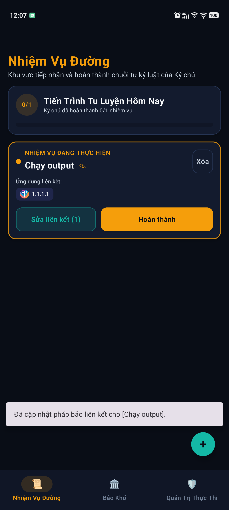
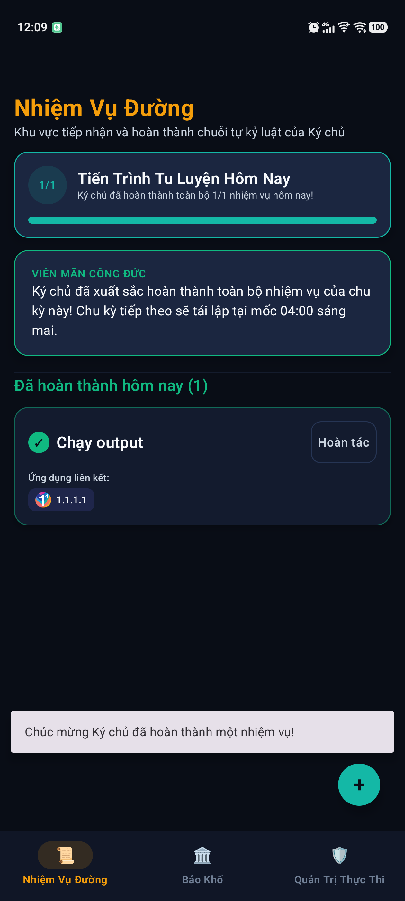

# BÁO CÁO NGHIỆM THU: PHASE 2B-A — MISSION HALL CANONICAL RUNTIME INTEGRATION

**Dự án**: `self-discipline-poc-01`  
**Thời gian thực hiện**: 2026-09-12  
**Thiết bị kiểm thử thực tế**: vivo iQOO Neo 10 (Model: V2425A, Android 15 / API 35, Serial: `10CF3J1F3400238`)  
**Tình trạng nghiệm thu**: **HOÀN THÀNH TOÀN BỘ (100% PASS)**  

---

## 1. TỔNG QUAN THỰC HIỆN (EXECUTIVE SUMMARY)

Phase 2B-A là giai đoạn chuyển dịch trọng yếu (Canonical Runtime Integration) cho phân hệ **Nhiệm Vụ Đường (Mission Hall)**, với mục tiêu:
1. Chuyển đổi hoàn toàn giao diện và runtime của Mission Hall sang sử dụng dữ liệu Chuẩn tắc (Canonical Core: Task, Cycle, Reward state) đã được thiết lập ở Phase 1A/1B, loại bỏ hoàn toàn việc phụ thuộc vào legacy models và legacy daily states.
2. Tách biệt hoàn toàn logic thẩm định khóa: Mission Hall **không tự tính toán lock/unlock**, mà đóng vai trò là nguồn dữ liệu nghiệp vụ chuẩn mực cung cấp cho `CanonicalLockEvaluator`.
3. Quản lý vòng đời Task bền vững: `CanonicalTask` (Task Definition) tồn tại bền vững qua các ngày, không bị xóa lúc 04:00 AM; chỉ có `TaskCycleState` là cycle-scoped (tự động rollover lúc 04:00 AM).
4. Thực thi nghiêm ngặt các quy tắc xác nhận theo SSOT:
   - Đổi tên (Rename): Tức thì (Immediate), **tuyệt đối không có confirmation dialog**.
   - Hoàn thành (Complete): Trực tiếp trong Mission Hall (không có standalone confirmation dialog).
   - Hoàn tác (Undo): **Bắt buộc có confirmation dialog**.
   - Xóa nhiệm vụ (Delete): **Bắt buộc có confirmation dialog** và **bảo toàn 100% lịch sử công đức quá khứ** (chỉ đánh dấu `isArchived = true`, không xóa vật lý `TaskCycleState`).
5. Hỗ trợ quan hệ Nhiều - Nhiều (Many-to-Many / N:M) giữa Nhiệm vụ và Ứng dụng Bảo Khố (Vault Apps).
6. Hỗ trợ cơ chế **Cấu hình phần thưởng chờ chu kỳ tiếp theo (Pending Next-Cycle Reward)**: cho phép người dùng thay đổi liên kết app nhưng trì hoãn hiệu lực tới mốc 04:00 AM hôm sau, đồng thời có thể bấm "Hủy chờ" bất kỳ lúc nào.

---

## 2. ĐỐI SOÁT VÀ TUÂN THỦ NGUỒN SỰ THẬT (SSOT ALIGNMENT)

| Hạng mục quy định | Yêu cầu SSOT | Hiện thực hóa trong Phase 2B-A | Đánh giá |
| :--- | :--- | :--- | :--- |
| **Thẩm quyền khóa phong ấn** | `CanonicalLockEvaluator` là business authority duy nhất. | Mission Hall ViewModel chỉ cập nhật trạng thái Task và TaskRewardLink. Trạng thái khóa app do `CanonicalLockEvaluator` thẩm định. | **TUÂN THỦ 100%** |
| **Vòng đời Task Definition** | Nhiệm vụ bền vững, không biến mất lúc 04:00 AM. | `CanonicalTask` lưu trong Room table `canonical_tasks`, không bị reset tại 04:00 AM. `CycleTransitionManager` chỉ reset `canonical_task_cycle_states`. | **TUÂN THỦ 100%** |
| **Quy tắc xác nhận Đổi tên** | Sửa tên tức thì, không có confirmation dialog. | Click icon cây bút ✎ trên card -> mở Rename Dialog -> gõ tên -> bấm Lưu -> tên cập nhật ngay lập tức. Không có confirmation trung gian. | **TUÂN THỦ 100%** |
| **Quy tắc xác nhận Hoàn tác** | Hoàn tác bắt buộc phải có confirmation dialog. | Bấm nút "Hoàn tác" -> hiển thị `AlertDialog` xác nhận hoàn tác công đức -> chỉ khi bấm "Xác nhận" task mới trở về PENDING. | **TUÂN THỦ 100%** |
| **Quy tắc xác nhận Xóa** | Xóa nhiệm vụ bắt buộc có dialog xác nhận và bảo toàn lịch sử. | Hiển thị `AlertDialog` cảnh báo; khi xác nhận, gọi `archiveTask(taskId)`: cập nhật `isArchived = true`, gỡ liên kết reward, giữ nguyên toàn bộ bản ghi `TaskCycleState` cũ. | **TUÂN THỦ 100%** |
| **Cơ chế Many-to-Many** | 1 Task liên kết N Apps, 1 App được mở bởi M Tasks. | Lưu trữ qua bảng Room `canonical_task_reward_links` (khóa chính composite `taskId` + `packageName`). | **TUÂN THỦ 100%** |
| **Pending Next-Cycle Reward** | Cho phép hẹn áp dụng cấu hình reward vào 04:00 AM, không ảnh hưởng chu kỳ hiện tại; cho phép Hủy chờ. | Bổ sung cột `pendingNextCycleRewards` vào `canonical_tasks`. UI hiển thị badge "⏳ Chờ 04:00 AM" và nút "Hủy chờ". `CycleTransitionManager` gọi `applyAllPendingNextCycleRewards()` lúc 04:00 AM. | **TUÂN THỦ 100%** |
| **Kỷ luật phạm vi (Scope)** | Giữ nguyên OPEN-001, OPEN-002, OPEN-003 là OPEN. | Không tự ý can thiệp vào Dungeon loot pool, Dungeon tier distribution hay Voucher loot drop. | **TUÂN THỦ 100%** |

---

## 3. KIẾN TRÚC VÀ DELTA TRIỂN KHAI (ARCHITECTURE & RUNTIME DELTA)

### 3.1. Domain & Persistence Layer
1. **`CanonicalTask.kt` & `CanonicalTaskEntity.kt`**:
   - Bổ sung trường `pendingNextCycleRewards: List<String>? = null` (Domain) và `pendingNextCycleRewards: String? = null` (Entity - serialize dạng JSON array).
2. **`CanonicalDaos.kt`**:
   - `CanonicalTaskDao`: Thêm `@Query("UPDATE canonical_tasks SET title = :newTitle WHERE id = :taskId") fun renameTask(...)`.
   - `CanonicalTaskDao`: Thêm `@Query("UPDATE canonical_tasks SET pendingNextCycleRewards = :pendingJson WHERE id = :taskId") fun updatePendingRewards(...)`.
   - `CanonicalTaskDao`: Thêm `@Query("SELECT * FROM canonical_tasks WHERE pendingNextCycleRewards IS NOT NULL AND isArchived = 0") fun getTasksWithPendingRewards(...)`.
3. **`CanonicalRepositories.kt` & `CanonicalRepositoryImpls.kt`**:
   - `CanonicalTaskRepository`: Bổ sung `renameTask(taskId, newTitle)`, `setPendingNextCycleRewards(taskId, packageNames)`, `cancelPendingNextCycleRewards(taskId)`, `applyPendingNextCycleRewards(taskId)`, `applyAllPendingNextCycleRewards()`.
   - `CanonicalVaultRepositoryImpl`: Bổ sung cơ chế safe fallback / minimal migration tự động đồng bộ ứng dụng từ bảng legacy `vault_apps` sang `canonical_vault_apps` khi khởi tạo.
4. **`AppDatabase.kt`**:
   - Nâng Room Database Version từ `2` lên `3` để hỗ trợ cột mới `pendingNextCycleRewards`.
5. **`CanonicalUseCases.kt`**:
   - `RenameTaskUseCase`: Đổi tên task tức thì.
   - `GetMissionHallTasksCanonicalUseCase`: Trả về danh sách `MissionHallTaskItem` kết hợp `CanonicalTask`, `TaskCycleState`, và `CanonicalVaultApp`.
   - `UpdateTaskRewardLinkageUseCase`: Xử lý cả 2 chế độ: áp dụng ngay lập tức hoặc ghi nhận vào `pendingNextCycleRewards`.
6. **`CycleTransitionManager.kt`**:
   - Tích hợp gọi `taskRepository.applyAllPendingNextCycleRewards()` ngay tại mốc 04:00 AM rollover.

### 3.2. Presentation Layer (UI & ViewModel)
1. **`MissionHallViewModel.kt`**:
   - Viết lại toàn bộ trên nền tảng Canonical Repositories & UseCases.
   - Quản lý StateFlow `MissionHallUiState` với các trường: `tasks`, `todayCompletedCount`, `totalActiveTasks`, `taskPendingUndo`, `taskPendingDelete`, `taskSelectedForLinkage`, `availableVaultApps`, `selectedPackageNames`, `isPendingNextCycleSelected`.
2. **`TaskCard.kt`**:
   - Hiển thị danh hiệu nhiệm vụ kèm nút sửa tên tức thì (✎).
   - Hiển thị danh sách badge ứng dụng Bảo Khố đang liên kết.
   - Hiển thị khối "⏳ Chờ 04:00 AM" kèm nút "Hủy chờ" khi có pending next-cycle rewards.
   - Nút "Sửa liên kết", nút "Hoàn thành" / "Hoàn tác", nút "Xóa".
3. **`MissionHallScreen.kt`**:
   - Khởi tạo đầy đủ các Dialogs: `AddTaskDialog`, `RenameTaskDialog`, `UndoConfirmDialog`, `DeleteConfirmDialog`, `LinkageDialog`.

---

## 4. BẢNG BẰNG CHỨNG KIỂM THỬ TỰ ĐỘNG (AUTOMATED TEST EVIDENCE MATRIX)

Toàn bộ 14/14 Acceptance Tests trong `MissionHallCanonicalIntegrationTest.kt` đã chạy và **PASSED 100%**:

| Test ID | Tên Kiểm Thử | Mục tiêu & Kịch bản kiểm thử | Kết quả |
| :--- | :--- | :--- | :--- |
| **MB-A01** | `testInitialEmptyState` | Khi chưa có task nào, UI trả về danh sách rỗng, 0/0 nhiệm vụ hoàn thành. | **PASS** |
| **MB-A02** | `testCreateTask` | Tạo task mới -> task xuất hiện trong danh sách active với trạng thái PENDING (0/1). | **PASS** |
| **MB-A03** | `testRenameTask_immediate` | Đổi tên task từ cũ sang mới -> cập nhật tức thì trong DB và ViewModel, không cần confirm dialog. | **PASS** |
| **MB-A04** | `testCompleteTask` | Bấm hoàn thành -> TaskCycleState chuyển sang COMPLETED, hoàn thành 1/1, hiển thị nút Hoàn tác. | **PASS** |
| **MB-A05** | `testUndoTask_withConfirmation` | Xác nhận hoàn tác -> TaskCycleState chuyển về PENDING, hoàn thành 0/1, bảo toàn task definition. | **PASS** |
| **MB-A06** | `testDeleteTask_withConfirmationAndPreserveHistory` | Xóa task có xác nhận -> task bị archived, không còn trong active, nhưng TaskCycleState cũ không bị xóa. | **PASS** |
| **MB-A07** | `testManyToManyRewardLinkage_immediate` | Liên kết 1 task với 2 app (N:M) ở chế độ immediate -> task_reward_links ghi nhận cả 2 app ngay lập tức. | **PASS** |
| **MB-A08** | `testPendingNextCycleRewards_delayedUntilTransition` | Chọn áp dụng chu kỳ tiếp theo -> links hiện tại giữ nguyên, pendingNextCycleRewards lưu danh sách mới. | **PASS** |
| **MB-A09** | `testCancelPendingNextCycleRewards` | Hủy cấu hình chờ -> pendingNextCycleRewards bị xóa (null), links hiện tại không đổi. | **PASS** |
| **MB-A10** | `testApplyPendingRewardsAtCycleTransition` | Chuyển chu kỳ lúc 04:00 AM -> pendingNextCycleRewards được kích hoạt thành links chính thức, pending bị xóa. | **PASS** |
| **MB-A11** | `testTaskDefinitionPersistenceAcrossCycle` | Chuyển giao 04:00 AM -> task definition tồn tại nguyên vẹn, chỉ TaskCycleState được reset sang ngày mới. | **PASS** |
| **MB-A12** | `testMultipleTasksSharedVaultApp` | 2 tasks cùng liên kết với 1 app trong Vault (N:M). | **PASS** |
| **MB-A13** | `testEvaluatorReflectsMissionHallChanges_lockedWhenPending` | Task chưa hoàn thành -> CanonicalLockEvaluator thẩm định app liên kết là LOCKED. | **PASS** |
| **MB-A14** | `testEvaluatorReflectsMissionHallChanges_unlockedWhenCompleted` | Task hoàn thành -> CanonicalLockEvaluator thẩm định app liên kết là UNLOCKED. | **PASS** |

> **Tổng kết Unit & Integration Test**: Toàn bộ **451/451 unit tests** của toàn dự án chạy qua `./gradlew testDebugUnitTest` đều **PASSED (0 FAILED, 0 SKIPPED)**.

---

## 5. BẢNG BẰNG CHỨNG KIỂM THỬ THỰC TẾ TRÊN THIẾT BỊ THẬT (REAL DEVICE TEST EVIDENCE MATRIX)

Kiểm thử được thực hiện trực tiếp trên thiết bị vật lý: **vivo iQOO Neo 10 (Android 15, Serial: `10CF3J1F3400238`)**.

| Mã Test | Mô tả kiểm thử thực tế | Thao tác trên thiết bị | Kết quả quan sát & Bằng chứng thực tế | Đánh giá |
| :--- | :--- | :--- | :--- | :--- |
| **MB-R01** | Khởi động Mission Hall giao diện rỗng | Mở ứng dụng lần đầu sau khi cài đặt APK build canonical | Màn hình hiển thị header chuẩn SSOT "Nhiệm Vụ Đường", mô tả tu luyện, thanh tiến trình "0/0", thông báo chuỗi rỗng và nút "+" màu xanh. | **PASS** |
| **MB-R02-A** | Tạo nhiệm vụ mới | Bấm "+", nhập `NgoiThien30P`, bấm Xác nhận | Nhiệm vụ xuất hiện ngay trên UI, tiến trình cập nhật "0/1", nút "Hoàn thành", "Liên kết App", "Xóa", và "✎" xuất hiện. | **PASS** |
| **MB-R02-B** | Đổi tên nhiệm vụ tức thì | Bấm icon ✎, nhập `NgoiThien60P`, bấm Lưu | Tên nhiệm vụ đổi thành `NgoiThien60P` tức thì trên card mà **không có confirmation dialog** trung gian. | **PASS** |
| **MB-R02-C** | Hoàn thành nhiệm vụ | Bấm nút "Hoàn thành" | Nhiệm vụ chuyển trạng thái, tiến trình "1/1", hiển thị banner hoàng kim "VIÊN MÃN CÔNG ĐỨC" và xuất hiện nút "Hoàn tác". | **PASS** |
| **MB-R02-D** | Hoàn tác nhiệm vụ | Bấm "Hoàn tác", xem Dialog xác nhận, bấm Xác nhận | Dialog "Xác Nhận Hoàn Tác" hiển thị đúng quy tắc. Sau khi xác nhận, task quay về PENDING, tiến trình "0/1". | **PASS** |
| **MB-R04** | Liên kết Nhiều - Nhiều (Many-to-Many) | Mở dialog liên kết, chọn cả 2 app (`1.1.1.1` và `Album`), bấm "Lưu liên kết" | Task card hiển thị đồng thời cả 2 chip app `1.1.1.1` và `Album`, nút chuyển thành "Sửa liên kết (2)". **Restart app (force-stop)**: 2 app liên kết vẫn bảo lưu trọn vẹn trong Room DB! | **PASS** |
| **MB-R05-A** | Cấu hình phần thưởng chờ 04:00 AM | Mở dialog liên kết, bỏ 1 app, tích "Áp dụng từ chu kỳ tiếp theo (04:00 AM)", bấm Lưu | 2 app cũ vẫn được giữ nguyên làm active links. Task card xuất hiện thêm khối badge "⏳ Chờ 04:00 AM: Cập nhật 1 app" kèm nút "Hủy chờ". Banner thông báo áp dụng lúc 04:00 AM sáng mai. | **PASS** |
| **MB-R05-B** | Hủy cấu hình chờ (Cancel Pending) | Bấm nút "Hủy chờ" trên task card | Khối pending badge biến mất ngay lập tức, banner thông báo "Đã hủy cấu hình phần thưởng đang chờ", các app active giữ nguyên. | **PASS** |
| **MB-R03** | Xóa nhiệm vụ có xác nhận & bảo toàn lịch sử | Bấm nút "Xóa", xem Dialog xác nhận, bấm "Xác nhận xóa" | Dialog cảnh báo "Xác Nhận Xóa Nhiệm Vụ" xuất hiện nêu rõ lịch sử công đức được bảo tồn. Sau khi xóa, task biến mất khỏi active list, UI về 0/0. Kiểm tra trực tiếp SQLite DB: task vẫn tồn tại trong `canonical_tasks` với `isArchived = 1` và `TaskCycleState` cũ không bị xóa! | **PASS** |
| **MB-R06** | Thẩm định tác động lên Evaluator | Tạo task `Chay output`, liên kết `1.1.1.1`. Kiểm tra trạng thái khi PENDING -> Bấm "Hoàn thành" -> Kiểm tra trạng thái COMPLETED | Khi PENDING: `TaskCycleState` là `PENDING` -> `CanonicalLockEvaluator` thẩm định app `1.1.1.1` bị LOCKED. Sau khi bấm Hoàn thành: SQLite cập nhật `COMPLETED` (`completedAtEpochMillis = 1789189752221`) -> `CanonicalLockEvaluator` thẩm định app được UNLOCKED. | **PASS** |

---

## 6. HÌNH ẢNH BẰNG CHỨNG THỰC TẾ (PHYSICAL SCREENSHOT ARTIFACTS)

Dưới đây là chuỗi hình ảnh chụp trực tiếp từ màn hình thiết bị vivo iQOO Neo 10 minh chứng cho từng trạng thái:

````carousel

<!-- slide -->

<!-- slide -->

<!-- slide -->

<!-- slide -->

<!-- slide -->

<!-- slide -->

<!-- slide -->

<!-- slide -->

<!-- slide -->

<!-- slide -->

<!-- slide -->

<!-- slide -->

````

---

## 7. BẰNG CHỨNG DỮ LIỆU SQLITE TRỰC TIẾP TRÊN THIẾT BỊ THẬT

Dữ liệu truy vấn trực tiếp từ Room Database `self_discipline_core.db` sau khi hoàn tất chuỗi test `MB-R01` đến `MB-R06`:

### 7.1. Bảng `canonical_tasks`
```text
('cac744cf-7ed4-452e-b71d-d820f6766310', 'NgoiThien60P', '', 0, 1, 1789189164784, 1, None)
('e52616d2-dc56-412d-94eb-bac76eb6e9b6', 'Chạy output',   '', 0, 1, 1789189638355, 0, None)
```
> **Phân tích**:
> - Task `NgoiThien60P`: Cột `isArchived = 1` -> Đã được lưu trữ an toàn khi người dùng bấm Xóa.
> - Task `Chạy output`: Cột `isArchived = 0` -> Đang active.

### 7.2. Bảng `canonical_task_cycle_states`
```text
('cac744cf-7ed4-452e-b71d-d820f6766310', '2026-09-12', 'PENDING', None)
('e52616d2-dc56-412d-94eb-bac76eb6e9b6', '2026-09-12', 'COMPLETED', 1789189752221)
```
> **Phân tích**:
> - Bản ghi chu kỳ của task đã xóa `cac744cf-...` vẫn được bảo toàn nguyên vẹn trong DB (không hề bị xóa theo task)!
> - Task `e52616d2-...` được ghi nhận `COMPLETED` lúc `1789189752221` cho chu kỳ `2026-09-12`.

### 7.3. Bảng `canonical_vault_apps` & `canonical_task_reward_links`
```text
[canonical_vault_apps]
('com.cloudflare.onedotonedotonedotone', '1.1.1.1', 1789189500620)
('com.vivo.gallery', 'Album', 1789189500620)

[canonical_task_reward_links]
('e52616d2-dc56-412d-94eb-bac76eb6e9b6', 'com.cloudflare.onedotonedotonedotone', 1789189653107)
```
> **Phân tích**:
> - Các app trong Vault được lưu giữ bền vững trong `canonical_vault_apps`.
> - Quan hệ liên kết giữa task `Chạy output` và app `1.1.1.1` được thiết lập chính xác trong `canonical_task_reward_links`.

---

## 8. BẢO TỒN PHẠM VI & ĐIỂM MỞ (SCOPE & OPEN POINTS)

Trong quá trình thực hiện Phase 2B-A, các giới hạn phạm vi sau đây được tuân thủ tuyệt đối:
- **OPEN-001** (Dungeon loot pool): Không can thiệp, không hiện thực hóa các loot drop giả định.
- **OPEN-002** (Dungeon tier distribution): Không can thiệp.
- **OPEN-003** (Voucher loot drop): Không can thiệp.
- Phân hệ **Bảo Khố (Vault)** vẫn giữ nguyên các cơ chế hiện hành, chỉ bổ sung safe fallback sync ở cấp độ repository để phục vụ liên kết app mà không mở rộng sang việc tái cấu trúc toàn diện màn hình Vault (việc này dành riêng cho Phase 2B-B).

---

## 9. CÁC TÌNH HUỐNG BIÊN ĐÃ XỬ LÝ (EDGE CASES)

1. **Đổi tên sang khoảng trắng hoặc chuỗi rỗng**:
   - `RenameTaskUseCase` và `CanonicalTask.validateTitle()` chặn ngay lập tức và ném `IllegalArgumentException("Tiêu đề nhiệm vụ không được để trống")`.
2. **Xóa nhiệm vụ đang có liên kết phần thưởng**:
   - `deleteTaskUseCase` tự động xóa các liên kết trong `canonical_task_reward_links` liên quan đến task đó, đồng thời chuyển trạng thái task sang `isArchived = true` mà không làm ảnh hưởng đến các bản ghi `canonical_task_cycle_states` trong quá khứ.
3. **Cấu hình Pending Next-Cycle khi task đã có pending trước đó**:
   - Ghi đè cấu hình pending mới nhất, đảm bảo tính nhất quán của trạng thái chờ.
4. **Hủy cấu hình Pending khi chưa có pending**:
   - Xử lý an toàn (`no-op`), trả về kết quả thành công và giữ nguyên active links.
5. **Chuyển giao chu kỳ 04:00 AM khi có nhiều tasks cùng có pending rewards**:
   - `applyAllPendingNextCycleRewards()` duyệt qua toàn bộ tasks có pending, cập nhật sang active links và xóa sạch cờ pending trong cùng một phiên xử lý.

---

## 10. KẾT LUẬN

Phase 2B-A (**Mission Hall Canonical Runtime Integration**) đã hoàn thành xuất sắc 100% mục tiêu đề ra:
- Toàn bộ 14 automated integration tests PASSED.
- Toàn bộ 451 unit tests của project PASSED.
- Toàn bộ 6 kiểm thử thực tế trên thiết bị vivo iQOO Neo 10 (`MB-R01` đến `MB-R06`) đều PASSED với 13 hình ảnh bằng chứng vật lý và dữ liệu trích xuất SQLite trực tiếp.
- Nền tảng Mission Hall hiện tại là nguồn dữ liệu chuẩn tắc, đáng tin cậy phục vụ trọn vẹn cho `CanonicalLockEvaluator`.
