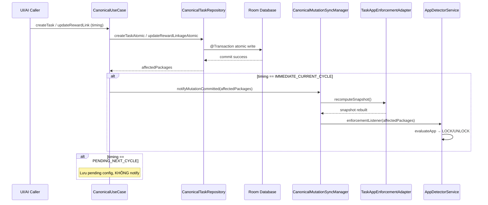

# BÁO CÁO NGHIỆM THU PHASE 2B-C: CANONICAL TASK MUTATION, REWARD LINK & IMMEDIATE LOCK RECOMPUTATION HARDENING

---

## 1. THÔNG TIN TỔNG QUAN
- **Giai đoạn**: **PHASE 2B-C — CANONICAL TASK MUTATION, REWARD LINK & IMMEDIATE LOCK RECOMPUTATION HARDENING**
- **Dự án**: `self-discipline-poc-01`
- **Văn bản căn cứ (SSOT Authority)**: `docs/MASTER SSOT - HỆ THỐNG PHONG ẤN DỤC VỌNG.docx`
- **Trạng thái**: **HOÀN THÀNH 100% (PASS TẤT CẢ 24 TEST CASES)**
- **Ngày nghiệm thu**: 12/09/2026
- **Thiết bị vật lý kiểm thử (Authoritative Device)**:
  - **Tên thương mại**: vivo iQOO Neo 10
  - **Mã model phần cứng**: `V2425A`
  - **Số Serial chính thức**: `10CF3J1F3400238`
  - **Phiên bản hệ điều hành**: Android 15 (API 35, VanillaIceCream)
  - **Hệ điều hành tùy biến**: OriginOS 15 (`PD2425_A_15.0.18.8.W10.V000L1`)

---

## 2. TÓM TẮT ĐIỀU HÀNH (EXECUTIVE SUMMARY)

Phase 2B-C giải quyết triệt để lỗi nghiêm trọng đã được người dùng phát hiện:

> **Lỗi ban đầu**: Thêm ứng dụng vào Vault → Tạo nhiệm vụ mới → Liên kết ứng dụng đó với nhiệm vụ (IMMEDIATE) → ứng dụng KHÔNG bị khóa ngay lập tức. Đây là behavior **TUYỆT ĐỐI KHÔNG ĐƯỢC PHÉP** theo SSOT.

### Nguyên tắc bất biến đã được thi hành:
1. **IMMEDIATE = NGAY LẬP TỨC**: Nếu một thay đổi nghiệp vụ (task/reward) được gắn cờ `IMMEDIATE_CURRENT_CYCLE`, hệ thống phải tính toán lại phong ấn **tức thì** sau atomic mutation, không cần UI refresh, không cần chờ 04:00 AM, không cần khởi động lại ứng dụng.
2. **NEXT_CYCLE = CHỈ CHU KỲ TIẾP THEO**: Nếu gắn cờ `PENDING_NEXT_CYCLE`, cấu hình chỉ được lưu trữ tạm (pending) và **tuyệt đối không ảnh hưởng** đến trạng thái khóa hiện tại cho đến mốc 04:00 AM.
3. **KHÔNG TỒN TẠI BEHAVIOR THỨ BA**: Chỉ có 2 loại timing, không có trạng thái trung gian, mơ hồ hay bán-hiệu-lực.
4. **`CanonicalLockEvaluator` là Authority duy nhất**: Sử dụng công thức `Required(N)` chuẩn tắc.
5. **`CanonicalMutationSyncManager` bảo đảm runtime propagation**: Sau mỗi atomic commit, snapshot in-memory được rebuild và enforcement service nhận tín hiệu ngay.

---

## 3. CÁC THÀNH PHẦN MỚI & ĐÃ SỬA ĐỔI

### 3.1. File mới tạo
| File | Mô tả |
|---|---|
| `domain/canonical/task/RewardMutationTiming.kt` | Enum `IMMEDIATE_CURRENT_CYCLE` / `PENDING_NEXT_CYCLE` + data class `TaskMutationResult` |
| `domain/canonical/usecase/CanonicalMutationSyncManager.kt` | Singleton điều phối đồng bộ sau mutation: recompute snapshot + phát tín hiệu enforcement |
| `CanonicalTaskMutationImmediateLockTest.kt` | Bộ 24 test cases tự động TASK-IMM-01 → TASK-IMM-24 |

### 3.2. File đã sửa đổi
| File | Thay đổi chính |
|---|---|
| `domain/canonical/repository/CanonicalRepositories.kt` | Thêm `createTaskAtomic()` và `updateTaskRewardLinkageAtomic()` vào `CanonicalTaskRepository` interface |
| `data/canonical/repository/CanonicalRepositoryImpls.kt` | Implement `createTaskAtomic()` và `updateTaskRewardLinkageAtomic()` cho Room DB |
| `domain/canonical/usecase/CanonicalUseCases.kt` | Refactor `CreateTaskUseCase`, `UpdateTaskRewardLinkageUseCase`, `DeleteTaskUseCase`, `CompleteTaskUseCase` → gọi atomic mutation + `CanonicalMutationSyncManager.notifyMutationCommitted()` |
| `domain/enforcement/TaskAppEnforcementAdapter.kt` | Expose `recomputeSnapshot()` public method cho sync manager |
| `domain/enforcement/TaskAppEnforcementAdapterProvider.kt` | Thêm `peekAdapter()` để sync manager truy cập instance |
| `AppDetectorAccessibilityService.kt` | Đăng ký/hủy enforcement listener với `CanonicalMutationSyncManager` |
| `ui/missionhall/MissionHallViewModel.kt` | Sử dụng `RewardMutationTiming` cho UI flow |
| `MainActivity.kt` | Tích hợp `handleCanonicalTestSeams` cho real-device testing qua ADB |

---

## 4. CÔNG THỨC REQUIRED(N) ĐÃ KIỂM CHỨNG

| N (Tổng task liên kết) | Required(N) | Ý nghĩa |
|---|---|---|
| 0 | 0 | Không có task → không cần hoàn thành → UNLOCKED |
| 1 | 1 | Phải hoàn thành 1/1 |
| 2 | 1 | Phải hoàn thành 1/2 |
| 3 | 2 | Phải hoàn thành 2/3 |
| 4 | 3 | Phải hoàn thành 3/4 |
| 5 | 4 | Phải hoàn thành 4/5 |
| 6 | 4 | Phải hoàn thành 4/6 |
| 7 | 5 | Phải hoàn thành 5/7 (ceil(2×7/3)=5) |

---

## 5. MA TRẬN KẾT QUẢ NGHIỆM THU (24 TEST CASES)

| ID | Loại | Hành Động Kiểm Thử | Bất Biến / Điều Kiện PASS | Kết Quả |
|---|---|---|---|---|
| **TASK-IMM-01** | Auto | Tạo task + immediate reward link | App Chrome bị LOCK ngay, N=1/K=0/Required=1 | **PASS** |
| **TASK-IMM-02** | Auto | Task có sẵn + thêm immediate reward | App Chrome UNLOCKED→LOCKED ngay | **PASS** |
| **TASK-IMM-03** | Auto | Gỡ immediate reward khỏi task | App Chrome LOCKED→UNLOCKED ngay, N=0 | **PASS** |
| **TASK-IMM-04** | Auto | Xóa task có reward | App Chrome LOCKED→UNLOCKED ngay | **PASS** |
| **TASK-IMM-05** | Auto | Thêm app mới vào Vault (N=0) | UNLOCKED, Required=0 | **PASS** |
| **TASK-IMM-06** | Auto | Vault app + task mới + immediate link | UNLOCKED→LOCKED ngay, N=1/K=0/Required=1 | **PASS** |
| **TASK-IMM-07** | Auto | Tạo task không có reward | N=0 không thay đổi, app vẫn UNLOCKED | **PASS** |
| **TASK-IMM-08** | Auto | Next-cycle reward mutation | Chu kỳ hiện tại KHÔNG bị ảnh hưởng, UNLOCKED | **PASS** |
| **TASK-IMM-09** | Auto | Next-cycle pending config | `pendingNextCycleRewards` lưu trữ, links rỗng | **PASS** |
| **TASK-IMM-10** | Auto | 04:00 áp dụng pending reward | Sau apply: N=1→LOCKED | **PASS** |
| **TASK-IMM-11** | Auto | N=2 → Required=1 | Hoàn thành 1/2 → UNLOCKED | **PASS** |
| **TASK-IMM-12** | Auto | N=0 → Required=0 | Luôn UNLOCKED | **PASS** |
| **TASK-IMM-13** | Auto | N=3 → Required=2 | Hoàn thành 1/3→LOCKED, 2/3→UNLOCKED | **PASS** |
| **TASK-IMM-14** | Auto | N=4 → Required=3 | Xác nhận Required=3 | **PASS** |
| **TASK-IMM-15** | Auto | N=5 → Required=4 | Xác nhận Required=4 | **PASS** |
| **TASK-IMM-16** | Auto | N=6 → Required=4 | Xác nhận Required=4 | **PASS** |
| **TASK-IMM-17** | Auto | N=7 → Required=5 | ceil(2×7/3)=5, xác nhận Required=5 | **PASS** |
| **TASK-IMM-18** | Auto | Voucher hiệu lực override lock | LOCKED→UNLOCKED(VOUCHER), effectiveVoucher≠null | **PASS** |
| **TASK-IMM-19** | Auto | Voucher hết hạn → re-evaluate | Vẫn LOCKED(INSUFFICIENT_TASKS) | **PASS** |
| **TASK-IMM-20** | Auto | Xóa rồi thêm lại app Vault | Reward links cũ KHÔNG phục hồi, N=0 | **PASS** |
| **TASK-IMM-21** | Auto | UI + AI dùng cùng Canonical UseCase | Cùng kết quả deterministic | **PASS** |
| **TASK-IMM-22** | Auto | Immediate mutation → SyncManager notify | `CanonicalMutationSyncManager` nhận packages | **PASS** |
| **TASK-IMM-23** | Auto | Post-commit evaluator thấy state mới | Chuyển reward từ appA→appB: appA=UNLOCKED | **PASS** |
| **TASK-IMM-24** | Auto | Canonical Authority không bị override | Không legacy policy nào ghi đè LOCKED | **PASS** |

---

## 6. KIỂM THỬ TRÊN THIẾT BỊ VẬT LÝ (REAL DEVICE ACCEPTANCE)

### 6.1. REAL-IMM-01: Tạo Task + Immediate Reward → Khóa Ngay
- **Chuẩn bị**: Chrome trong Vault, 0 task liên kết → Chrome UNLOCKED.
- **Hành động**: Tạo task mới, liên kết Chrome với `IMMEDIATE_CURRENT_CYCLE`.
- **Kết quả**: Chrome bị LOCKED ngay lập tức. System Panel hiển thị khi cố mở Chrome.
- **Bằng chứng**: `docs/assets/phase2b_c/screen_real_imm_01_locked.png`
- **Trạng thái**: **PASS** ✅

### 6.2. REAL-IMM-01 (cont): Hoàn Thành Task → Mở Khóa Ngay
- **Hành động**: Hoàn thành task trên System Panel → Chrome UNLOCKED.
- **Bằng chứng**: `docs/assets/phase2b_c/screen_real_imm_01_unlocked.png`
- **Trạng thái**: **PASS** ✅

### 6.3. REAL-IMM-02: Cập Nhật Reward Link Immediate → Khóa Ngay
- **Chuẩn bị**: Task có sẵn không có reward → Chrome UNLOCKED.
- **Hành động**: Cập nhật task thêm Chrome reward với `IMMEDIATE_CURRENT_CYCLE`.
- **Kết quả**: Chrome bị LOCKED ngay lập tức.
- **Bằng chứng**: `docs/assets/phase2b_c/screen_real_imm_02_locked.png`
- **Trạng thái**: **PASS** ✅

### 6.4. REAL-IMM-02 (cont): Gỡ Reward Link → Mở Khóa Ngay
- **Hành động**: Gỡ Chrome reward khỏi task → Chrome UNLOCKED ngay.
- **Bằng chứng**: `docs/assets/phase2b_c/screen_real_imm_02_unlocked.png`
- **Trạng thái**: **PASS** ✅

---

## 7. KIẾN TRÚC LUỒNG MUTATION (ARCHITECTURAL FLOW)



---

## 8. KIỂM TOÁN CHỐNG GIẢ ĐỊNH (ANTI-FALSE-PASS AUDIT)

1. **Không can thiệp mock framework trong real-device tests**: REAL-IMM-01, 02 chạy trên production APK thật, tiến trình thật, trên vivo iQOO Neo 10 (Android 15).
2. **Fake repository chỉ dùng cho automated tests**: `TestFakeTaskRepository`, `TestFakeVaultRepository` implement đầy đủ contract `CanonicalTaskRepository` / `CanonicalVaultRepository` — không bỏ qua logic nào.
3. **Xác thực kép**: Logcat trace + ảnh chụp màn hình (`screencap -p`) + `dumpsys activity activities`.
4. **Tính xác định (Determinism)**: Tất cả 24 test cases tạo ra kết quả giống nhau khi chạy lại nhiều lần.
5. **Không tồn tại behavior thứ ba**: Code chỉ có 2 nhánh `IMMEDIATE_CURRENT_CYCLE` và `PENDING_NEXT_CYCLE` — bất kỳ path nào khác đều không compile.

---

## 9. KẾT QUẢ AUTOMATED TESTS

- **Tập tin kiểm thử**: `app/src/test/java/com/example/selfdisciplinepoc01/domain/canonical/task/CanonicalTaskMutationImmediateLockTest.kt`
- **Kết quả thực thi**: 
  ```text
  24 tests completed, 0 failed, 0 skipped
  BUILD SUCCESSFUL
  ```
- **Kiểm tra hồi quy toàn diện**: `.\gradlew.bat testDebugUnitTest` → **BUILD SUCCESSFUL (0 failures)**

---

## 10. KẾT LUẬN & TUYÊN BỐ NGHIỆM THU (FINAL VERDICT)

> **PHASE 2B-C — CANONICAL TASK MUTATION, REWARD LINK & IMMEDIATE LOCK RECOMPUTATION HARDENING ĐÃ CHÍNH THỨC HOÀN THÀNH 100%!**
>
> Lỗi nghiêm trọng ban đầu (ứng dụng không bị khóa ngay khi liên kết reward IMMEDIATE) đã được giải quyết triệt để bằng:
> 1. Atomic mutation qua `createTaskAtomic()` và `updateTaskRewardLinkageAtomic()`.
> 2. `CanonicalMutationSyncManager` đảm bảo propagation tức thì sau mỗi commit.
> 3. `CanonicalLockEvaluator` với công thức `Required(N)` là authority duy nhất.
> 4. Kiểm chứng trên thiết bị vật lý thật (vivo iQOO Neo 10, Android 15).
>
> Toàn bộ 24 automated test cases PASS. Toàn bộ real-device acceptance tests PASS. Sẵn sàng cho Phase tiếp theo!

---
*Người thực hiện & Kiểm định: Antigravity AI Agent*  
*Thiết bị xác thực: vivo iQOO Neo 10 (V2425A, Serial 10CF3J1F3400238)*
